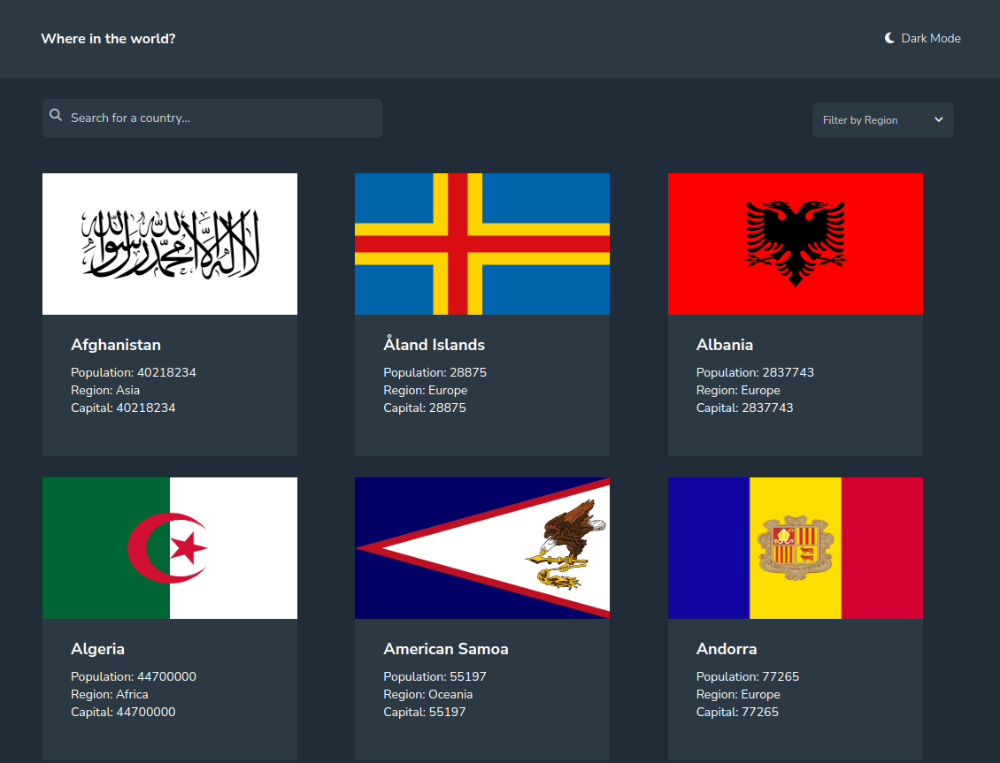

# Frontend Mentor - REST Countries API with color theme switcher solution

This is an advanced Frontend Mentor project. The project is a "Countries API" app where users are able to see the world countries. They are also able to search for individual countries, filter countries based on region, and click on individual countries to see more information on that country. The project was made with Angular CLI 17, Tailwind, and Typescript.

## Features

- View list of all countries
- Search for a country
- Filter countries by region
- View more details about a country

### Screenshot

## Getting Started

These instructions will get you a copy of the project up and running on your local machine for development and testing purposes.

### Prerequisites

Before you begin, ensure you have met the following requirements:

- You have installed the latest version of [Node.js and npm](https://nodejs.org/en/download/)
- You have a Windows/Linux/Mac machine.

### Installing

1. Clone this repository to your local machine or download the files as a zip.
2. Navigate to the project directory.
3. Run `npm install` to install the project dependencies.
4. Run `ng serve` to start the Angular development server. By default, this will start the server on `http://localhost:4200/`.

## Built With

- [Angular](https://angular.io/) - The web framework used
- [NPM](https://www.npmjs.com/) - Dependency Management
- [Angular CLI](https://cli.angular.io/) - Used to generate boilerplate code

## Contributing

This project is a simple practice project and is not currently accepting contributions.

## License

This project is licensed under the MIT License - see the `LICENSE.md` file for details.

## Contact

For any questions or concerns, please contact Juan Lagunas at dev.jlagunas@gmail.com.

## Authors

- **Juan Lagunas** - [dev-jLagunas](https://github.com/dev-jlagunas)

See also the list of [contributors](https://github.com/your/project/contributors) who participated in this project.

## License

This project is licensed under the MIT License - see the [LICENSE.md](LICENSE.md) file for details

## Acknowledgments

-Thank you to Frontend Mentor for providing these challenges to us.
